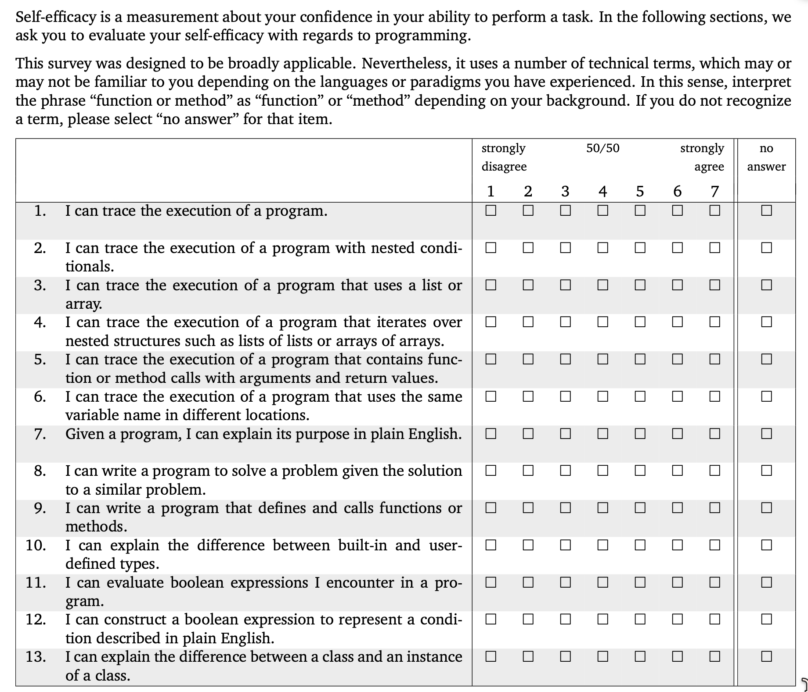
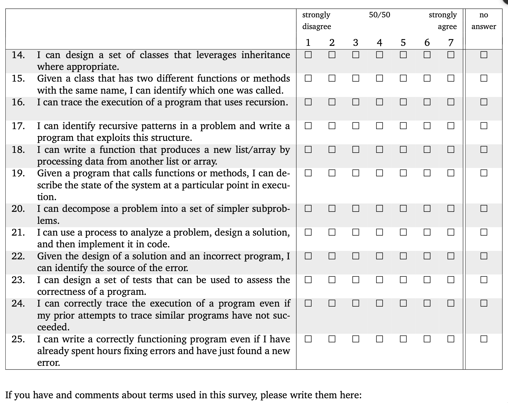
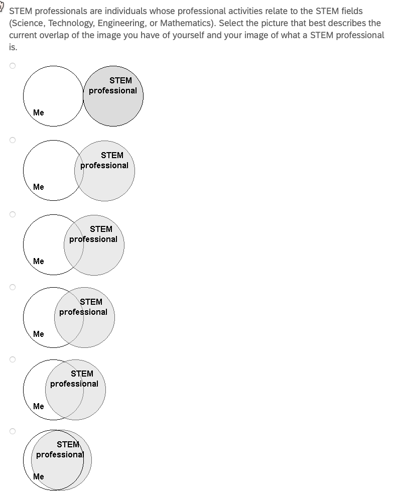
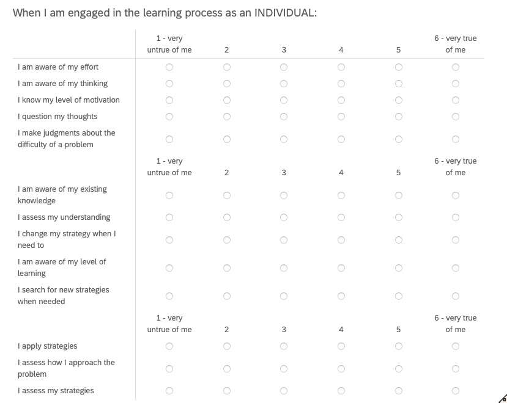
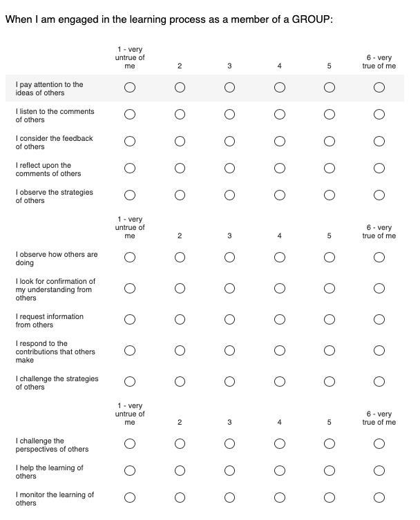

# UNIVERSITY OF MAINE

# Group and Individual Reflection and Collaboration

Principal Investigator: Dr. Gregory L. Nelson, Assistant Professor, Department of Computer Science, College of Liberal Arts and Sciences (CLAS), University of Maine

Application Narrative:

## 1. Funding

N/A.

## 2. Summary

This study investigates how social reflection (reflecting together in small groups), individual reflection, and combinations of the two support people's learning, professional skills, self-efficacy, professional identity, and improvement over time, in settings outside of and independent of any single course or semester. Prior research has shown that metacognitive and reflective strategies and peer support can improve learning outcomes (Chan & Lee, 2021; Lim et al., 2022), and reflection groups are effective and common in teacher and medical professional education, but there is little research on scalable, sustainable, peer-based reflection practices in computing and how to design them for adoption beyond a single course.

The research team offers reflection groups outside of any course, integrating working professionals as peers. Positive results in this setting will also inform future adoption pathways, such as a standalone one-credit reflection-groups course.

Two terms are used throughout this application, including its appendices. **Members** are the people who take part in the reflection groups and the other reflection activities the research team offers. Those activities are a service that would be offered regardless of this research; they are not themselves research, and their design is not part of this application. **Participants** are the people who take part in the research: those whose reflection-group materials are used as research data, those who respond to a research survey, and those who take part in a research interview. Most participants are also members, but the two roles are separate, and the comparison population described below are participants who are not members.

This study covers reflection and collaboration activities outside of courses: ongoing reflection groups for current students (outside their coursework), recent graduates and alumni, working professionals participating as peers, and community members in informal or online reflection communities; the matching and behavior-change tools that support these groups; and comparative evaluation including professional comparison samples. The reflection groups and reflection activities are offered as an ongoing service to members and would be offered regardless of this research; this protocol governs the research use of data generated by that service, plus research-specific activities (surveys, interviews, and comparison groups).

None of the data generated by reflection-group activities and used as research data is sensitive in nature. It concerns learning, professional skills, and taking part in a small group. The intake survey a member completes on joining a group includes standard demographic items, one of which asks about disability or accommodations and may be left unanswered; no other category of sensitive information is collected anywhere in this study.

For the purposes of the research "outcomes" below refers to: professional skills & dispositions, learning, career, and other personal and social outcomes. For example, professional skills (such as iterative improvement, lifelong learning, psychological safety, and communication), self-efficacy, professional identity, and other personal, professional, and group outcomes.

Research Questions:

1. What are the effects of and outcomes from reflection activities, such as reflection groups?

2. Which design features of reflection activities, such as reflection groups, most support members and outcomes?

3. What barriers and enablers shape whether people adopt and sustain reflection practices within and after participating in reflection groups, including maintaining and transferring skills and other outcomes from their prior experiences?

4. What reflection group designs, such as mixing and not mixing members with different prior experience levels, lead to more positive effects from reflection groups?

5. For reflection groups, what balance of scaffolding (such as regular reflection questions) and agency/adaptability (such as groups determining and changing reflection questions) leads to better long-term outcomes?

Methods:

This research is expected to run over multiple years. Participation is not tied to a course or semester. Reflection groups run in participation cycles of approximately 12 weeks; new cycles may begin at any time of year, and activities recur at general intervals rather than on an academic calendar. Groups that wish to continue meeting after a cycle ends may do so. All group meetings, information sessions, and whole-cohort activities are held online (analogous to an online class). Recruitment for each part of the research is in Section 4 and consent for each part is in Section 5; neither is repeated here.

Reflection-group materials collected as part of normal reflection-group activities:

Groups of about three to five members meet online for about 30 minutes at a regular interval over a participation cycle, with a guided agenda that the group adapts to suit itself, and each member writes a brief individual reflection afterwards. These activities are the service, not the research, so no instrument appendix is included for them. Each item below states what the research would use and how it is collected. Group meetings are not recorded — no audio and no video is captured — and no researcher attends a meeting.

1. Intake survey, completed online in Qualtrics when a member joins, which the service uses to form compatible groups. It collects availability, background, prior programming experience, demographics, baseline outcome measures, and the member's email address.

2. Icebreaker responses, written by members online in their group's shared workspace before or during their first meeting.

3. Group meeting agenda notes, written by members themselves online in their group's shared workspace during each meeting, including the notes from the longer retrospective meeting at the end of a participation cycle.

4. Individual written reflections, completed online in Qualtrics after each meeting and visible only to the research team.

5. Notes and materials from the optional whole-cohort activity held about halfway through a cycle, and from the co-design sessions in which members suggest improvements to the reflection-group designs, both held online.

6. Usage data from the online tool that supports the groups — for example responses to its reminders and which of its features are used — exported from the tool.

Research data collected outside of normal reflection group activities:

7. Longitudinal follow-up surveys. Members are invited to confidential follow-up surveys, taken online in Qualtrics, each taking approximately 10–15 minutes. The surveys are confidential rather than anonymous: each response carries the participant's email address as an identifier, handled as described in Section 6. Invitations are sent at approximately 3 months and 6 months after a member's group begins, and then approximately every 6 months, for up to four years (up to nine follow-up surveys in total); each is a separate invitation and a participant may respond to some and not others. The survey questions are in Appendix C, and the consent form that appears as the first page of every follow-up survey is in Appendix B.

8. Interviews. A purposeful subset of members is invited to confidential individual interviews about their experiences, professional-skill behaviors, and changes over time. Interviews are one-to-one; there are no group interviews. Each takes approximately 30–60 minutes and is conducted online on Zoom or in person, according to the participant's preference and researcher availability. Interviews are audio-recorded and transcribed; no video is recorded. Online interviews are recorded using Zoom's audio-only recording; in-person interviews are recorded on a password-protected handheld audio recorder. Agreeing to be recorded is not required in order to take part: a participant who prefers not to be recorded is interviewed with the researcher taking written notes instead. Recordings are transcribed by the named investigators. The interview guide is in Appendix E and the interview consent form is in Appendix D.

Interviews are scheduled where a member's experience is likely to be informative rather than on a fixed calendar. For example: shortly before or after a member joins a group; at the midpoint of a participation cycle; at the end of a cycle, following the group's retrospective meeting; after a member leaves a group, or after their group stops meeting; and after a follow-up survey response indicates something worth understanding in more depth, such as a large change in a self-efficacy or professional-identity measure, or a written answer describing a barrier to sustaining a reflection practice. Members may also ask to be interviewed. A participant may be interviewed more than once — for example once after each participation cycle.

9. Comparison group. For comparative evaluation, the team will separately recruit a comparison group of working professionals for surveys and optional interviews. A modification will be submitted for control group details at a later date to the IRB for review and approval prior to any recruitment for this group beginning. That modification will state the timing, mode, length, and confidentiality of the comparison-group surveys and interviews, and will include the survey and interview instruments as appendices. The compensation offered to this group is stated in Section 9.

Data collected:

1.1 Reflection-group intake survey responses: availability, background, demographics, baseline outcome measures, and contact email.

1.2 Reflection group materials: icebreaker responses, meeting agenda notes including the end-of-cycle retrospective, individual written reflections, and notes and materials from whole-cohort activities and co-design sessions.

1.3 Tool-usage data (for example, reminder responses and feature use), linked by the same participant identifier; no separate instrument.

1.4 Longitudinal follow-up survey responses: email address and outcome measures (Appendix C).

1.5 Interview audio recordings and transcripts, and, where a participant declines recording, interview notes (interview guide in Appendix E).

1.6 Comparison-group survey and interview data, to be specified in the modification described above.

1.7 Compensation information, for participants who receive a gift card: the details the University requires in order to issue and record the payment, collected on the separate form in Appendix G. These are administrative records rather than research data. They are stored apart from all research data and are never linked to a participant's survey responses, interview, or written reflections.

References:

Chan, C. K. Y., & Lee, K. K. W. (2021). Reflection literacy: A multilevel perspective on the challenges of using reflections in higher education through a comprehensive literature review. Educational Research Review, 32, 100376.

Edmondson, A. (1999). Psychological safety and learning behavior in work teams. Administrative Science Quarterly, 44(2), 350–383.

Grant, A. M., Franklin, J., & Langford, P. (2002). The Self-Reflection and Insight Scale: A new measure of private self-consciousness. Social Behavior and Personality, 30(8), 821–835.

Kember, D., Leung, D. Y. P., Jones, A., Loke, A. Y., McKay, J., Sinclair, K., Tse, H., Webb, C., Wong, F. K. Y., Wong, M., & Yeung, E. (2000). Development of a questionnaire to measure the level of reflective thinking. Assessment & Evaluation in Higher Education, 25(4), 381–395.

Lim, R. B. T., Hoe, K. W. B., & Zheng, H. (2022). A systematic review of the outcomes, level, facilitators, and barriers to deep self-reflection in public health higher education: Meta-analysis and meta-synthesis. Frontiers in Education, 7, 938224.

## 3. Personnel

PI: Dr. Gregory L. Nelson, Assistant Professor, Department of Computer Science, CLAS, University of Maine (gregory.nelson@maine.edu).

Roles: Principal Investigator, study design, reflection group and tool design, data analysis, recruiting, interviewing.

Experience: 5+ years of human-computer interaction and computing education research with human participants.

Cyril Agbewali-Koku, PhD Student, Department of Computer Science, CLAS, University of Maine (cyril.agbewalikoku@maine.edu).

Roles: Research assistant; study and design contributions, data analysis, recruiting, survey administration, interviewing.

Experience: ~1 year research experience with human participants.

Troy Schotter, Lecturer and PhD Student, Department of Computer Science, CLAS, University of Maine (troy.schotter@maine.edu).

Roles: design, data analysis, recruiting.

Experience: ~2 years research experience with human participants.

## 4. Participant recruitment

Participant Population:

Participants are adults age 18 or older. Because this protocol is not tied to a specific course, the population includes current university students (participating outside their coursework), recent graduates and alumni, working professionals, and community members in informal or online reflection communities. Individuals younger than 18 are excluded.

Reflection groups are normally formed in sizes of 3–5 members (typically 5). Given we will openly recruit people online to be a part of the study, over 5 years we may have up to 1,000 participants, including participants who participate in various reflection activities or in comparisons group who do some or none of the reflection activities.

Participant Identification and Recruitment Procedures:

How members come to join a reflection group is not part of this application, because the groups themselves are not research. What follows is the recruitment for each part of the research. All recruitment texts are in Appendix F.

(1) Recruitment for research use of reflection-group materials.

At the first session of each reflection group, a member of the research team reads the verbal script in Appendix F.1. It states that this is a University of Maine research study, names the researcher speaking and gives contact information, explains that the team is asking to use the materials the group's activities generate as research data, lists those materials, states that meetings are not recorded, and explains how to decline. The opt-out form in Appendix A is emailed to every member of the group on the same day, so that members who were not at the first session receive it too.

(2) Recruitment of members for the longitudinal follow-up surveys.

Members are invited by the email in Appendix F.2, sent at each survey point. It states that this is research in its opening lines, names a researcher and gives contact information, gives the length of the survey and the compensation offered, and links to the survey, whose first page is the consent form in Appendix B.

(3) Recruitment of members for interviews.

Members are invited by the email in Appendix F.3, at the points described in Section 2. It states that this is research in its opening lines, names a researcher and gives contact information, states the length and format of the interview, states that the interview is audio-recorded and that a member who prefers not to be recorded may take part with written notes instead, states the compensation offered, and carries a scheduling link. The interview consent form (Appendix D) is sent with the invitation.

(4) and (5) Recruitment of the comparison population for surveys and for interviews.

Comparison-group professionals will be recruited through the research team's newsletters, email invitations to alumni networks, and social media announcements. No professional recruiting company or agency is used. The evaluation plan anticipates that later-year comparative studies will involve intervention populations of roughly 60–100 participants and comparison groups of roughly 200 professionals. A modification will be submitted for control group recruitment details at a later date to the IRB for review and approval prior to any recruitment for this group beginning; the recruitment texts will be submitted with it, and are reserved as Appendices F.4 and F.5.

If any participants are recruited from courses currently taught by a member of the research team, the protections of the approved course-based protocol also apply: participation has no effect on grades.

## 5. Informed consent

Consent is handled separately for each part of the research, and all of it is electronic. Consistent with exempt review, no consent form is signed and no signature is collected. Everyone must be at least 18 years of age.

(1) Research use of reflection-group materials — opt-out.

Members do not need to do anything in order for their reflection-group materials to be used as research data. The opt-out form in Appendix A is emailed to every member on the day of their group's first session, after the verbal script in Appendix F.1 has been read at that session. A member who does not wish their materials to be used for research emails any member of the research team with the subject line “Opt out of reflection research”; the form gives the addresses and the wording, and no reason has to be given. We ask for a decision within two weeks of the first session, so that a member's materials are not archived for research before they have decided, but a member may opt out at any later time and their materials are then deleted from the research data, for as long as we are still able to locate them (Section 6). A member who opts out stays in their reflection group on exactly the same terms.

(2) Longitudinal follow-up surveys.

The consent form in Appendix B appears as the first page of every follow-up survey. Submitting the survey indicates consent, and the form carries a checkbox and email block by which a participant records that choice before the questions appear.

(3) Interviews.

The interview consent form in Appendix D is emailed with the interview invitation and the scheduling link. The researcher goes through it with the participant at the start of the interview and answers any questions before any recording begins. Taking part in the interview indicates consent.

(4) and (5) Comparison population — surveys and interviews.

A modification will be submitted for control group consent details at a later date to the IRB for review and approval prior to any recruitment for this group beginning. The comparison-group survey and interview consent forms will be submitted with it. They will follow Appendices B and D, adapted so that the purpose statement reads “to understand professionals’ skills, learning, and reflection practices over time, as a comparison for evaluating reflection-group programs” and so that nothing in them refers to reflection-group activities.

## 6. Confidentiality

Initially, all data will be stored on a secure cloud storage platform (Google Drive) that encrypts all data at rest and in transit with AES-256 bit encryption and is password protected. Identifiable data are accessible only to the research personnel named in Section 3.

The reflection-group materials described in Section 2 items 1–6 are written by members themselves; no meeting is recorded, by audio or by video, and no researcher attends a meeting. Members' gender and disability status, reported on the intake survey and used for group matching, are never disclosed to other members.

Survey data — the intake survey, the individual written reflections, and the longitudinal follow-up surveys — are collected and stored in a secured cloud platform (Qualtrics). IP addresses are not collected in any survey. Survey responses are exported to the secure cloud storage platform and deleted from Qualtrics within 14 days of collection.

Interviews are conducted online (Zoom) or in person. Recordings of online interviews are removed from Zoom within 72 hours and stored on the secure cloud storage platform; recordings made on a handheld recorder for in-person interviews are removed from the device within 72 hours and stored in the same place. Recordings are transcribed by the named investigators; no outside transcription service is used.

Information needed to issue compensation is collected on a separate form (Appendix G), administered independently of every research instrument. It is stored apart from research data, is used only to issue and record the payment and to meet the University's reporting requirements, and is never joined to a participant's responses. A participant who prefers not to provide it may still take part in the research; they simply cannot be sent a gift card.

Within 14 days after the end of a participant's participation in an activity cycle, or for data collected on an ongoing basis, within 14 days of collection, all data (including Qualtrics data) will be archived to a separate cloud data platform, with all participant identifiers (such as email addresses) replaced with a randomly generated encrypted key. During this archiving, the data of members who have opted out of research use are filtered out and deleted, by looking up their email addresses and removing the records associated with them.

The key file that maps to participants' email addresses and participant demographic data will be stored in a separate folder; it is stored electronically and is encrypted. Five years after a participant's participation ends, their email address will be deleted from the key file; for example, for a participant whose participation ends in Fall 2026, the key entry will be deleted by the end of December 2031. This is to allow participants to withdraw their consent later if they wish. We can only delete participant data while the key exists.

The archived, de-identified data will be retained indefinitely.

In summary, the following data from participants who take part in the research will be retained indefinitely in de-identified form: reflection-group intake survey responses (1.1), reflection group materials (1.2), tool-usage data (1.3), longitudinal follow-up survey responses (1.4), and interview transcripts and notes (1.5).

Original audio recordings of interviews are not retained indefinitely. Each recording is deleted at the same time as the participant's email address is deleted from the key file, five years after that participant's participation ends — for example, for a participant whose participation ends in Fall 2026, by the end of December 2031. Because this protocol anticipates recruiting over about five years, no audio recording will be retained beyond December 2036.

Participants' privacy and right to withdraw from the study will be respected, so we will delete any of their data upon request as long as the request is within 5 years of the end of their participation, as otherwise their email address will have been deleted from the key file.

## 7. Risks to participants

There are risks of time and inconvenience to participants. There is a minimal risk of a data breach; we expect a potential risk of embarrassment in that event. To minimize this risk, participant emails are replaced with a randomized unique identifier that cannot be traced back to the email address no later than 14 days after participation ends; this identifier is stored separately along with demographic and any other personally identifiable information.

The consent page at the start of each survey makes clear that any question can be skipped if the participant does not feel comfortable answering, and participants are told the same at the start of an interview.

## 8. Benefits

There are no direct benefits to participants.

The research may improve understanding of scalable, adoptable, and effective reflection-based practices for supporting learning, professional skills, and lifelong learning across educational and professional settings. Findings may inform pedagogical practice, may support adoption across institutions, and may contribute to understanding how to sustain professional growth after graduation. These are potential benefits to others rather than promised outcomes.

## 9. Compensation

There is no compensation for the research use of reflection-group materials.

For each longitudinal follow-up survey a participant submits (Appendix C), the participant will be offered a $10 electronic VISA gift card, sent by email within 48 hours of survey submission. Participants must reach the end of the survey to receive compensation, though they may skip individual questions. A participant who submits all nine follow-up surveys over four years would receive $90 in total.

Participants who complete an interview will be offered a $25 electronic VISA gift card, sent by email within 48 hours of the interview. Compensation is offered per interview: a participant who takes part in an interview after one participation cycle and another after the next cycle would receive $50 in total.

Comparison-group participants are offered the same compensation as members: a $10 electronic VISA gift card for each follow-up survey submitted, and a $25 electronic VISA gift card for each interview completed.

Receiving a gift card requires submitting the information the University needs in order to issue and record the payment. This is collected on the separate form in Appendix G, administered outside any survey or interview and never linked to a participant's responses; see Section 6. No individual gift card exceeds $50. University policy does not permit gift cards to be used to compensate University employees, so a participant employed by the University of Maine is not offered a gift card; student employees of the University may receive one. A participant who cannot be offered a gift card takes part on the same terms in every other respect.

Where the cumulative compensation one participant receives exceeds $75, the tax-reporting information described in Appendices B and D is provided to the appropriate University office.

Gift cards are sent as each survey is submitted and as each interview is completed. The final gift cards under this protocol will be distributed no later than December 2035, which is the end of the four-year follow-up window for the last participation cycle this protocol anticipates.

There is no compensation for other activities.

## Appendix A: Opt-out form for research use of reflection group materials

UNIVERSITY OF MAINE — RESEARCH OPT-OUT FORM

Group and Individual Reflection and Collaboration

Researchers:

- Gregory L. Nelson, Assistant Professor, Computer Science Department, University of Maine (gregory.nelson@maine.edu) (Principal Investigator, Main Contact)
- Cyril Agbewali-Koku, Computer Science Department, University of Maine (cyril.agbewalikoku@maine.edu)
- Troy Schotter, Lecturer and PhD Student, Computer Science Department, University of Maine (troy.schotter@maine.edu)

You are invited to be part of a research project being conducted by Dr. Gregory L. Nelson, a faculty member in the Department of Computer Science at the University of Maine. The reflection group you have joined is a service we offer, and it is not research. This form is about something separate: whether the materials your group's activities produce may also be used as research data. The purpose of the research is to study how reflecting — on your own and together with others in small groups — affects learning, professional skills, self-efficacy, professional identity, and improvement over time. You must be at least 18 years of age to be part of the research.

### What Will You Be Asked to Do?

You are not asked to do anything extra, and this asks no additional time of you beyond the reflection group itself. Everything listed here is something you do in the group anyway. If you are willing for it to be used as research data, you do not need to do anything at all. What we would use:

- The intake survey you filled out when you joined, including your availability, background, prior programming experience, and demographic answers;
- Your icebreaker answers;
- Your group's meeting agenda notes, including the notes from the longer retrospective meeting at the end of a cycle;
- The brief individual reflection you write after each meeting;
- Notes and materials from the whole-cohort activity and from any session where members suggest improvements to the reflection groups;
- How you use the online tool that supports your group, such as your responses to its reminders.

Your group meetings are not recorded. No audio and no video is captured, and no researcher sits in on your meetings.

### Risks

- Time and inconvenience: none beyond the reflection group itself;
- Loss of confidentiality of your data, although we will protect your data as described in the Confidentiality section.

### Benefits

- There are no direct benefits to you;
- This research may improve understanding of effective ways to support learning and professional skills, which may benefit future students, professionals, and the broader community.

### Confidentiality

Your data will be stored in password-protected systems accessible only to the research team, using software that provides additional security (encryption). Your email address will be used as an identifier so we can connect your information across activities and remove your data if you ask us to.

Your gender and disability status, which you may have given on the intake survey and which we use to match you into a group, are never shown to other members.

Within 14 days after your participation in a cycle ends, or within 14 days of collection for ongoing data, your identifiers will be replaced with a randomly generated key. The key file mapping your email and your demographic data will be stored separately, and it is encrypted. Five years after your participation ends, your email will be deleted from the key file; for example, if your participation ends in Fall 2026, by the end of December 2031. After that, we can no longer locate your data to delete it. The de-identified archived data will be retained indefinitely.

### Compensation

There is no compensation for the research use of your reflection group materials.

### Voluntary

Being part of the research is voluntary, and it is separate from the reflection group. Whether or not your materials are used for research makes no difference to your place in your group, to how your group is run, or to anything else we offer you.

If you do not want your reflection group materials used as research data, email any of the researchers listed above with the subject line “Opt out of reflection research”. Please do this within two weeks of your group's first session if you can, so that we do not archive your materials for research before you have decided. You may also opt out later at any time, and we will delete your materials from the research data for as long as we are still able to locate them — that is, until your email address is removed from the key file five years after your participation ends. You do not have to give a reason.

If you are willing for your materials to be used as research data, you do not need to do anything.

### Contact Information

If you have any questions about this study, please contact any of the researchers listed above, including the Principal Investigator, Dr. Gregory L. Nelson (gregory.nelson@maine.edu). If you have any questions about your rights as a research participant, please contact the Office of Research Compliance, University of Maine, 207-581-2657 (or e-mail umric@maine.edu).

You do not need to sign or return this form. Please keep it for your records.

## Appendix B: Longitudinal follow-up survey consent form (submission indicates consent)

UNIVERSITY OF MAINE — CONSENT FORM (Surveys)

Group and Individual Reflection and Collaboration

Researchers:

- Gregory L. Nelson, Assistant Professor, Computer Science Department, University of Maine (gregory.nelson@maine.edu) (Principal Investigator, Main Contact)
- Cyril Agbewali-Koku, Computer Science Department, University of Maine (cyril.agbewalikoku@maine.edu)
- Troy Schotter, Lecturer and PhD Student, Computer Science Department, University of Maine (troy.schotter@maine.edu)

You are invited to participate in a research project led by Dr. Gregory L. Nelson, a faculty member in the Department of Computer Science at the University of Maine. The purpose of the research is to study how individual and group reflection affect learning, professional skills, self-efficacy, professional identity, and improvement over time. You must be at least 18 years of age to participate.

### What Will You Be Asked to Do?

Take a confidential, online follow-up survey that will take 10–15 minutes. You may be invited to take further follow-up surveys over time — at approximately 3 months and 6 months after your reflection group begins, and then about every 6 months, for up to four years (up to nine follow-up surveys in total). Each one is a separate invitation, and you may respond to some and not others.

### Risks

Time and inconvenience; loss of confidentiality of your data, although we will protect your data as described below.

### Benefits

There are no direct benefits to you, but your responses help improve understanding of effective ways to support learning and professional skills.

### Confidentiality

Your responses are confidential, not anonymous. Your responses will be stored in a password-protected system using software that provides additional security (encryption). Your email address is used as an identifier so we can connect your responses across activities and remove your data if you ask us to. Your responses are exported from the survey platform and deleted from it within 14 days of collection. We do not collect IP addresses. Within 14 days of collection, your identifiers are replaced with a randomly generated key; the key file and your demographic data are stored separately, and your email is deleted from the key file five years after your participation ends — for example, if your participation ends in Fall 2026, by the end of December 2031 — after which your data can no longer be located for deletion. De-identified archived data are retained indefinitely.

### Compensation

For each longitudinal follow-up survey you submit, you will be compensated with a $10 electronic VISA gift card, sent by email within 48 hours of submission. You must reach the end of the survey to receive this compensation, though you may skip the occasional question. One gift card is offered per survey invitation. For example, if you submit four follow-up surveys over two years, that would be $40 in total; if you submit all nine over four years, that would be $90 in total.

To send you a gift card, we need a few details that the University requires. You give these on a short separate form. It is not part of the survey. What you put on it is never linked to your answers. You do not have to fill it out. If you skip it, you stay in the study just the same. We just cannot send you a gift card.

The University does not allow gift cards to be used to pay its own employees. So if you work for the University of Maine, other than as a student employee, we cannot offer you a gift card. You are welcome to take part in every other way, on the same terms.

If the total compensation you receive from us goes over $75, basic information (your name and address, date of payment, value of payment, and the researcher’s name) will be given to a University office for tax reasons:

- If you are an employee of UMaine (including a student employee): information will be sent to the Human Resources Department. The value of the compensation may be added as wages and subject to taxation.
- If you are not an employee: information will be sent to the Purchasing Department. If you receive $600 or more during a calendar year (January 1 – December 31) from participating in UMaine research projects, a Form 1099 will be generated and mailed to you. If you do not receive that much, the information will be destroyed at the end of the calendar year.

### Voluntary

Participation is voluntary. Submission of this survey indicates consent to participate. You may skip any questions and stop at any time. You may revoke consent at any time until your email is removed from the key file (five years after your participation ends; for example, if your participation ends in Fall 2026, by the end of December 2031) by emailing any member of the research team with the subject line “Opt out of reflection research.”

### Contact Information

Questions about this study: Dr. Gregory L. Nelson (gregory.nelson@maine.edu). Questions about your rights as a research participant: Office of Research Compliance, University of Maine, 207-581-2657 (or e-mail umric@maine.edu).

Your choice below indicates that you have read the above information and agree to participate. You will receive a copy of this form.

☐ I consent to being part of this study

_____________________________________

Email

## Appendix C: Longitudinal follow-up survey

Your Email:

*Majors, Career*

How confident do you feel in your programming abilities? (Scale: 1-7, where 1 is "Not confident at all" and 7 is "Very confident")

How comfortable are you reading, writing, speaking, and listening in English? (Scale: 1-7, where 1 is "Not comfortable at all" and 7 is "Extremely comfortable")

How many hours do you work for pay or at a job, each week, on average?

What jobs and/or careers do you currently have, if any? (Open-ended question)

**Part A: If you are still in university or other education/training programs (if not, skip to Part B below):**

What are some future careers you are considering after college? (Open-ended question)

What is your intended major(s) and/or minor(s)? (Open-ended question)

What year of university are you in? (Select one: Freshman (First Year), Sophomore (Second Year), Junior (Third Year), Senior (Fourth Year), Graduate Student, Other - please specify)

**Part B: If you are no longer taking courses, please answer the following (if not, skip and click the Next button below):**

What are some future jobs or careers you are considering after or in addition to your current ones? (Open-ended question)

What major(s) and/or minor(s) did you graduate with and when? (Open-ended question)

*Self-efficacy*

Self-efficacy is a measurement about your confidence in your ability to perform a task. In the following sections, we ask you to evaluate your self-efficacy with regards to programming.

This survey was designed to be broadly applicable. Nevertheless, it uses a number of technical terms, which may or may not be familiar to you depending on the languages or paradigms you might have experienced. In this sense, interpret the phrase "function or method" as "function" or "method" depending on your background. If you do not recognize a term, please select "no answer" for that item.

(free response textbox for the question above)

*Professional and STEM identity*

*Sense of belonging*

1. I feel like I "belong" in computer science.

2. I consider myself as a scientist, technologist, engineer, or mathematician.

3. I take pride in my computing abilities.

on a 5-point Likert scale ranging from 1 = strongly disagree to 5 = strongly agree, with a 3 = neutral.

*Professional and reflection skills*

I feel a sense of belonging in computer science.

Strongly disagree, Somewhat disagree, Neither agree nor disagree, Somewhat agree, Strongly agree

Please describe your answer:

Please describe the long-term effects on yourself, if any, from the reflection groups and/or your individual reflections?

What practices, if any, have you continued or partly continued from the reflection groups and/or your individual reflections?

If so, around how often do you do each of those practices?

Please share potential improvements for the reflection groups:

If there is anything else you would like to add that might be relevant, please do so here.

We value and appreciate your sharing and responses to these questions.

## Appendix D: Interview consent form

UNIVERSITY OF MAINE — CONSENT FORM (Interview)

Group and Individual Reflection and Collaboration

Researchers:

- Gregory L. Nelson, Assistant Professor, Computer Science Department, University of Maine (gregory.nelson@maine.edu) (Principal Investigator, Main Contact)
- Cyril Agbewali-Koku, Computer Science Department, University of Maine (cyril.agbewalikoku@maine.edu)
- Troy Schotter, Lecturer and PhD Student, Computer Science Department, University of Maine (troy.schotter@maine.edu)

You are invited to take part in a confidential interview as part of this research, led by Dr. Gregory L. Nelson, a faculty member in the Department of Computer Science at the University of Maine. You must be at least 18 years of age to participate.

### What Will You Be Asked to Do?

- Take part in a one-to-one interview about your experiences in the reflection activities, your professional-skill behaviors, and changes over time. The interview will be 30–60 minutes. It is conducted online (Zoom) or in person, based on your preference and researcher availability, and is audio-recorded; no video is recorded. If you would rather not be recorded, we will take written notes instead, and you can still take part.

You may be invited to more than one interview over time — for example, one after each participation cycle. Each invitation is separate, and you may accept some and not others. The total time depends on how many you take part in: three interviews would be about 1.5–3 hours in total. You will be emailed a scheduling link to sign up.

### Risks

- Time and inconvenience;
- Loss of confidentiality of your data, although we will protect your data as described in the Confidentiality section.

### Benefits

- There are no direct benefits to you, but you may reflect more on your learning and professional skills, which may help you develop skills useful in your education and career;
- This research should help us learn more about how to design reflection groups that support learning and professional skills (or why particular designs do not work), which will benefit future participants.

### Confidentiality

All interview data (recordings, transcripts, and notes) will be stored in password-protected computer systems accessible only to the research team, using software that provides additional security (encryption). Your email address will be used as an identifier so that we may relate answers from one method of information gathering to the others, as well as give us the ability to remove any data if you decide later that you want any of your data deleted.

If the interview is online, the recording is taken with the meeting platform's audio-only recording (Zoom) and removed from that platform within 72 hours. If the interview is in person, the recording is made on a password-protected handheld recorder and removed from that device within 72 hours. Either way it is then stored on the secure cloud platform described above. Recordings are transcribed by the researchers named above; we do not use an outside transcription service.

Within 14 days of collection, all data will be archived to a cloud data platform, with any of your identifiers (such as email address) replaced with a randomly generated key stored on a password-protected computer with software that provides additional security (encryption). The key file that maps to your email address and demographic data will be stored in a separate Cloud data platform. Five years after your participation ends, your email address will be deleted from the key file; for example, if your participation ends in Fall 2026, the key entry will be deleted by the end of December 2031. This is to allow you to withdraw your consent to participating in the research later if you wish. We can only delete your data until the key file is deleted.

Notes and transcripts from the interviews will be copied onto a cloud data platform, with any of your identifiers replaced with your key. The archived data will be retained indefinitely, except for the original audio recordings, which will be deleted at the same time as when your email address is deleted from the key file, five years after your participation ends. For example, if your participation ends in Fall 2026, the audio recording will be deleted by the end of December 2031.

Your privacy and right to withdraw from the study at any point (even after an interview) will be respected, so we will delete any of your data upon your request as long as it is within five years of the end of your participation, as otherwise your email address will have been deleted from the key file.

### Compensation

For each interview, you will be compensated with a $25 electronic VISA gift card. You must reach the end of the interview in order to receive this compensation, though you may skip the occasional question. You will receive your compensation by email within 48 hours of the interview. For example, if you take part in an interview after one participation cycle and then another after the next cycle, that would be two interviews and $50 in total.

To send you a gift card, we need a few details that the University requires. You give these on a short separate form. It is not part of the interview. What you put on it is never linked to your answers. You do not have to fill it out. If you skip it, you stay in the study just the same. We just cannot send you a gift card.

The University does not allow gift cards to be used to pay its own employees. So if you work for the University of Maine, other than as a student employee, we cannot offer you a gift card. You are welcome to take part in every other way, on the same terms.

If the total compensation you receive from us goes over $75, basic information (your name and address, date of payment, value of payment, and the researcher’s name) will be given to a University office for tax reasons:

- If you are an employee of UMaine (including a student employee): information will be sent to the Human Resources Department. The value of the compensation may be added as wages and subject to taxation.
- If you are not an employee: information will be sent to the Purchasing Department. If you receive $600 or more during a calendar year (January 1 – December 31) from participating in UMaine research projects, a Form 1099 will be generated and mailed to you. If you do not receive that much, the information will be destroyed at the end of the calendar year.

### Voluntary

Participation is voluntary. You may skip any interview questions and stop at any time. You may revoke consent for any portion of this research study at any time until your email address is removed from the key file (five years after your participation ends; for example, if your participation ends in Fall 2026, by the end of December 2031). If you wish to revoke consent, contact one of the researchers by email and we will update your status in our records; you would need to agree again to this consent form before any further information is gathered.

### Contact Information

If you have any questions about this study, please contact any of the researchers that are a part of the study: gregory.nelson@maine.edu (Principal Investigator, Main Contact), cyril.agbewalikoku@maine.edu, troy.schotter@maine.edu. If you have any questions about your rights as a research participant, please contact the Office of Research Compliance, University of Maine, 207-581-2657 (or e-mail umric@maine.edu).

Taking part in the interview indicates that you have read the above information and agree to participate. You will receive a copy of this form.

## Appendix E: Interview guide

Interviews are semi-structured and one-to-one. The interviewer follows up on what the participant raises, and not every topic is covered in every interview.

Opening, before any recording begins: "Thank you for making the time. Before we start I will go through the consent form with you and answer any questions. With your agreement I will record the audio of this conversation so that I can have it transcribed; no video is recorded. If you would rather I did not record, I will take written notes instead, and we can go ahead either way. You can skip any question and stop at any time."

Topics:

1. Background and current situation: what you are studying or working on now, and what brought you to a reflection group.

2. Your experience of the group: what a typical meeting was like for you, what your group chose to spend its time on, and how that changed over the cycle.

3. What, if anything, has changed for you — in your learning, in your confidence, in how you see yourself professionally, and in the professional skills your group discussed. Examples of specific occasions are welcome.

4. Reflection practices: what you do now, if anything, that you did not do before; how often; and what makes it easy or hard to keep up.

5. Design features: which parts of the group's design helped and which got in the way — for example the guided agenda, your group's freedom to set its own agenda, the individual written reflections, the short skill videos, and group size.

6. Group composition: your experience of a group that did or did not mix people with different levels of prior experience, and of groups that did or did not include working professionals.

7. Barriers and enablers to keeping a reflection practice going after a group ends, or after leaving a group.

8. The whole-cohort activities and any sessions where members suggested improvements to the reflection groups: what you took from them.

9. What you would change about the reflection groups.

10. Anything else you would like to add that we have not asked about.

## Appendix F: Recruitment texts

### F.1 Verbal script — research use of reflection group materials

Read aloud by a member of the research team at the first session of each reflection group, and emailed to every member of that group the same day together with the opt-out form in Appendix A.

> Before we start, I want to tell you about a research study, because it is separate from this group. I am [name], [role] in the Department of Computer Science at the University of Maine, and you can reach me at [email]. Dr. Gregory L. Nelson leads the study, at gregory.nelson@maine.edu.

> This reflection group is something we offer regardless of the research, and nothing about it changes based on what you decide here. What we are asking is whether we may also use the materials this group produces as research data: the intake survey you filled out when you joined, your icebreaker answers, the agenda notes your group writes during meetings, the short individual reflection you write after each meeting, notes and materials from the whole-cohort and improvement sessions, and how you use the tool that supports the group. Your meetings are not recorded — no audio and no video — and no researcher sits in on them. There is no compensation for this part.

> You do not have to do anything. If you are willing, there is nothing to fill in. If you would rather your materials were not used for research, email any of us with the subject line “Opt out of reflection research”. It helps if you decide within two weeks, but you can change your mind later at any time, and it makes no difference to your place in this group either way.

> I will email everyone the form with all of this written down, including who to write to, right after this session. Are there any questions?

### F.2 Email — longitudinal follow-up survey invitation

> Subject: Follow-up survey — University of Maine reflection research

> Greetings, I am [name], [role] in the Department of Computer Science at the University of Maine ([email]). I am writing about the research study on reflection that runs alongside the reflection groups, led by Dr. Gregory L. Nelson (gregory.nelson@maine.edu). Here is the link to a confidential follow-up survey: <insert link>. It takes about 10–15 minutes and asks about your learning, professional skills, and reflection practices. The first page is the consent form, and submitting the survey indicates your consent. Taking part is voluntary and you may skip any question. For each follow-up survey you submit, you will receive a $10 electronic VISA gift card within 48 hours; to send it we will ask you for a few details on a short separate form that is never linked to your answers. Questions are welcome — just reply to this message. Thank you again for your time and contribution,

### F.3 Email — interview invitation

> Subject: Interview invitation — University of Maine reflection research

> Greetings, I am [name], [role] in the Department of Computer Science at the University of Maine ([email]). I am writing to invite you to a confidential interview for our research study on reflection, led by Dr. Gregory L. Nelson (gregory.nelson@maine.edu). The interview is one-to-one, takes about 30–60 minutes, and is held on Zoom or in person, whichever you prefer. It is audio-recorded so that it can be transcribed; no video is recorded, and if you would rather not be recorded I will take written notes instead and you can still take part. We would ask about your experience of the reflection activities, your professional skills, and what has changed for you over time. For each interview you complete you will receive a $25 electronic VISA gift card within 48 hours; to send it we will ask you for a few details on a short separate form that is never linked to your answers. The consent form is attached, and I will go through it with you before we begin. Here is a scheduling link if you would like to take part: <insert link>. Taking part is voluntary. Questions? Reply to this message. Thank you,

### F.4 and F.5 — comparison population, surveys and interviews

Reserved for the comparison-population survey and interview recruitment texts. A modification will be submitted for control group recruitment details at a later date to the IRB for review and approval prior to any recruitment for this group beginning.

## Appendix G: Compensation information form

Administered through Qualtrics as a standalone form, separately from every research instrument, to participants who have earned a gift card and wish to receive one. It is linked from the confirmation message at the end of a compensated survey and sent by email after an interview. Responses are stored apart from research data and are never joined to a participant's survey responses, interview, or written reflections.

Introduction: You have completed an activity for which we offer compensation. To issue and record the payment, the University requires some information from you. This form is separate from the study. What you enter here is not connected to your answers, and no one analyzing the research data sees it. Completing this form is optional: if you would rather not, you remain in the research on exactly the same terms and we simply cannot send you a gift card.

Because University policy does not permit gift cards to be used to compensate University employees, a participant employed by the University of Maine is not offered a gift card. Student employees of the University may receive one, and where their total compensation from University research exceeds the reporting threshold, the tax-reporting process described in the consent form applies.

1. Full name (as it should appear on University payment records):

2. Mailing address:

3. Email address to which the electronic gift card should be sent:

4. Are you currently employed by the University of Maine, including as a student employee? (Yes / No)

5. Confirmation of receipt: I acknowledge that I will receive an electronic gift card of the value stated in the consent form for this activity. (Checkbox)

Completed by the research team, not by the participant: the activity compensated, the date, the value of the gift card, and the name of the researcher issuing it. These are recorded in the study's disbursement log, which is held with the University's required gift card documentation rather than with the research data. Where a participant's cumulative compensation exceeds the reporting threshold, the information described in the consent forms is forwarded to the appropriate University office, and a W-9 is collected where the University requires one.